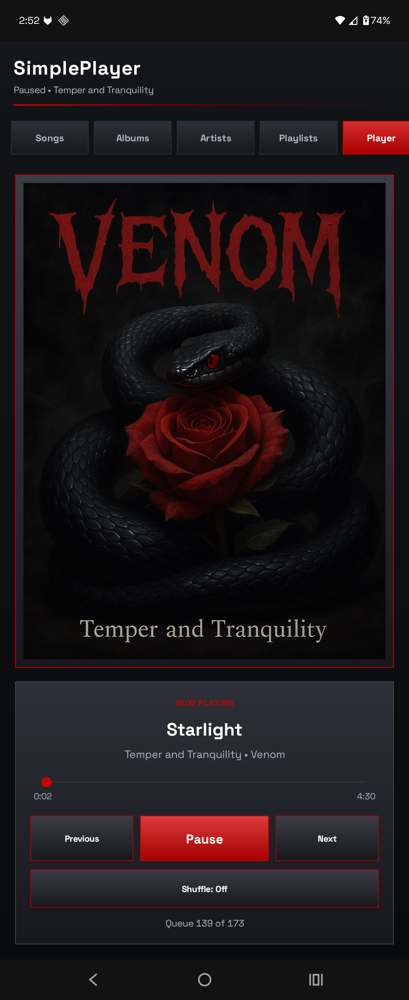
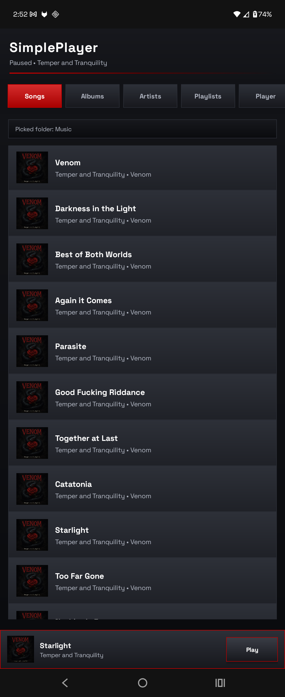
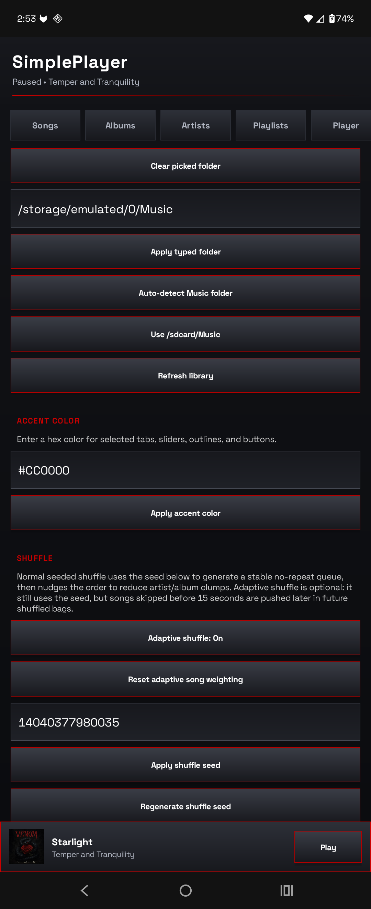

# SimplePlayer

A local Android music player for people who still believe music files are files and not tiny subscription hostages.

<p align="center">
  
  
  
</p>

SimplePlayer is a dark, minimal, local-only music player for Android 7.0 Nougat/API 24 and newer. It plays your music, reads your metadata, supports album art, handles playlists as editable text files, and does not ask you to make an account because it is not spiritually unwell.

Simple does not mean primitive. That was discussed. Repeatedly.

Package name:

```text
com.zoeykl.simpleplayer
```

Current version:

```text
0.5.0
```

## What It Does

SimplePlayer plays local audio from a folder you choose.

It has library tabs for:

```text
Songs
Albums
Artists
Playlists
Player
Settings
```

It supports:

```text
Local folder scanning
Android folder picker access
WAV-heavy libraries
Embedded metadata
RIFF/WAV INFO metadata fallback
Embedded album art
Folder-side album art
Plain text playlists
Seeded shuffle
Optional adaptive shuffle
Notification controls
Headset/Bluetooth controls
Android Auto browsing
Portrait and landscape layouts
Custom accent color
Dark grey polished UI
```

No cloud sync. No recommendations. No podcast tab. No algorithm trying to spiritually colonize your listening habits.

## The Point

SimplePlayer is meant to be a simple music player, not a primitive music player.

That means:

```text
Simple controls
Readable library
Local files
Editable playlists
Predictable shuffle
Good metadata handling
No account garbage
No surprise online features
```

It is not trying to be Spotify, Poweramp, VLC, or a social network wearing headphones.

## Music Folder

SimplePlayer can scan music from a chosen folder.

The default behavior tries to find a folder literally named:

```text
Music
```

If Android is being cooperative, this usually means something like:

```text
/storage/emulated/0/Music
/sdcard/Music
/storage/XXXX-XXXX/Music
```

On newer Android versions, direct file paths may be hidden or inconsistent because apparently letting users access their own files was too emotionally dangerous. For that reason, SimplePlayer also supports Android’s folder picker.

Use Settings to pick the folder that actually contains your music.

## Supported Audio

SimplePlayer is designed around normal local audio files, including:

```text
.mp3
.flac
.wav
.wave
.m4a
.aac
.ogg
.opus
```

WAV files are supported.

However, WAV metadata is often a crime scene. Some WAVs have tags. Some have RIFF INFO chunks. Some have absolutely nothing except audio data and vibes. SimplePlayer reads what it can and falls back to filenames/folders when the file gives it nothing useful.

## Metadata

SimplePlayer reads metadata during library scans.

It tries:

```text
Android MediaMetadataRetriever
RIFF/WAV INFO chunks for WAV/WAVE files
Filename and folder fallback
```

Metadata currently feeds:

```text
Songs
Albums
Artists
Player screen
Notification player
Media session
Android Auto
Shuffle/queue display
```

Supported metadata includes, where available:

```text
Title
Artist
Album
Track number
Genre
Year
Duration
Album art
```

If your files are tagged badly, SimplePlayer will display them badly, because it is a music player, not a priest.

## Album Art

SimplePlayer checks album art in this order:

```text
Embedded album art
Same-folder artwork files
Android MediaStore album art
Placeholder art
```

Same-folder artwork filenames include:

```text
AlbumArtSmall.jpg
AlbumArt_..._Small.jpg
AlbumArt.jpg
Folder.jpg
Cover.jpg
Front.jpg
```

It also checks common variants such as:

```text
.jpeg
.png
.webp
```

So if your album folder has `AlbumArtSmall.jpg`, SimplePlayer should use it.

## Playlists

Playlists are plain text files.

Because playlists do not need to be trapped in a database like a Victorian child in an attic.

Playlist folder:

```text
/sdcard/Music/SimplePlayer/Playlists/
```

Every `.txt` file in that folder becomes a playlist.

The playlist name is the filename without `.txt`.

Example:

```text
Road Music.txt
```

becomes:

```text
Road Music
```

Each non-empty line is one song reference.

Simple filename example:

```text
Deftones - Change.mp3
Nine Inch Nails - We're In This Together.flac
Carpenter Brut - Turbo Killer.mp3
```

Relative path example, useful when duplicate filenames exist:

```text
Deftones/White Pony/Change.mp3
Nine Inch Nails/The Fragile/We're In This Together.flac
Carpenter Brut/Trilogy/Turbo Killer.mp3
```

Lines starting with `#` are ignored:

```text
# This song is commented out because we are making adult choices.
# Nine Inch Nails - Hurt.mp3
```

SimplePlayer can create playlists in-app, add songs to playlists, and read playlists edited outside the app.

## Queue Behavior

From the Songs tab:

```text
Tap a song:
Plays from the full Songs queue, starting at that song.

Long-press a song:
Shows extra actions.
```

Long-press actions:

```text
Play this song only
Add to playlist...
```

“Play this song only” creates a one-song queue.

“Add to playlist...” lets you add the selected song to an existing playlist or create a new playlist.

## Shuffle

SimplePlayer has two shuffle modes:

```text
Seeded shuffle
Adaptive shuffle
```

### Seeded Shuffle

Seeded shuffle is deterministic.

Same seed plus same song list equals the same shuffled order.

It does not pick a random song one at a time like a goblin with a dartboard. It builds a shuffled queue/bag, then plays through that bag without repeats until the bag is exhausted.

It also does a light de-clumping pass to reduce back-to-back runs of the same artist or album.

You can regenerate or manually set the shuffle seed in Settings.

### Adaptive Shuffle

Adaptive shuffle is optional.

When enabled, SimplePlayer pays attention to songs skipped very early. If a song plays for less than about 15 seconds before being skipped, that song is deweighted and pushed later in future shuffle bags.

It is not banned. It is not deleted. It is just told to stand farther back in line because it disappointed you.

Settings includes:

```text
Adaptive shuffle toggle
Reset adaptive song weighting
```

Normal seeded shuffle remains the default.

## Player Refresh

The player interface updates itself every 0.5 seconds while the activity is alive.

That means the seek bar, elapsed time, duration, queue info, shuffle state, and current track display should update without needing to poke the screen like it owes you money.

## Controls

SimplePlayer supports:

```text
On-screen controls
Notification shade controls
Headset controls
Bluetooth controls
Car/media buttons
Android Auto browsing
```

The notification mini-player uses Android’s native media-style notification system. This is the correct way to do it, even if Android sometimes insists on rendering things with the aesthetic confidence of a microwave UI.

## Android Auto

SimplePlayer exposes a media browser service for Android Auto.

Android Auto can browse:

```text
Songs
Albums
Artists
Playlists
```

Open the app on the phone first, grant permissions, and pick/scan your music folder. Android Auto cannot pick your folder for you because Android Auto is not here to help; it is here to enforce rules.

## UI

SimplePlayer uses a dark grey interface with square controls, subtle gradients, accent color highlights, song thumbnails, a bottom now-playing bar, and a cleaner player layout.

The design goal is:

```text
Minimal
Readable
Fast
Dark
Not ugly on purpose
```

## Permissions

Depending on Android version, SimplePlayer may request:

```text
Read external storage
Read media audio
Notification permission
Foreground service/media playback support
Folder picker access
```

The app needs these because it plays local music files, not because it is mining your soul for engagement metrics.

## Build Notes

This project uses a simple launcher-style Gradle setup intended to be easy to build locally without installing Gradle globally.

Minimum Android version:

```text
Android 7.0 Nougat / API 24
```

Package/application ID:

```text
com.zoeykl.simpleplayer
```

Language:

```text
Java
```

UI:

```text
Programmatic Android views
```

Playback:

```text
Android MediaPlayer + foreground playback service + MediaSession
```

No Kotlin ceremony. No Compose dependency pile. No framework rodeo.

## Known Limitations

Some WAV files have little or no metadata. SimplePlayer cannot read tags that do not exist.

Android may hide direct file paths on newer versions. Use the folder picker if scanning looks wrong.

Android Auto depends on the phone app already having permission and a scanned library.

Notification layout is partly controlled by Android. If it looks slightly different across devices, blame the rectangle factory.

Plain text playlists resolve against the currently scanned library. If you move files or change the music folder, playlist entries may stop matching until the paths/filenames line up again.

## Version History

### 0.1.0 — BlackShufflePlayer Prototype

Initial local music player prototype.

Added:

```text
Nougat/API 24 minimum support
Local music library concept
Songs/Albums/Artists/Playlists layout
Player screen
Album art support
Black theme
Custom accent color idea
Shuffle-bag playback
Plain text playlist concept
```

This was the “can this exist without becoming awful?” version.

The answer was yes, but it was still wearing cardboard shoes.

### 0.2.0 — SimplePlayer Rename and Settings

Renamed the app to:

```text
SimplePlayer
```

Changed package/application ID to:

```text
com.zoeykl.simpleplayer
```

Added:

```text
Settings tab
Music folder setting
Accent color setting moved into Settings
Dark grey background instead of pure black
Square buttons
Square tabs
Square rows
Playlist folder changed to SimplePlayer
```

Removed the early “random buttons floating around like a debug panel” vibe.

### 0.3.0 — Folder Scanning and Android 16 Survival

Improved scanning for newer Android behavior.

Added:

```text
Auto-detect Music folder behavior
Refresh library moved into Settings
Top Refresh and Settings buttons removed
Better MediaStore path handling
Relative path fallback
Broader scan fallback when filtered results are empty
```

This was the “why can Android see my ringtone but not my actual music?” era. Historically important. Emotionally annoying.

### 0.4.0 — WAVs, Folder Picker, Seeded Shuffle

Added stronger local-library handling and real shuffle controls.

Added:

```text
Explicit WAV/WAVE handling
Direct recursive folder scan fallback
Android folder picker support
Persisted folder access
Seed-based shuffle setting
Regenerate shuffle seed button
Stable shuffle order from seed
Full Songs queue when tapping from Songs tab
Long-press song actions
Play this song only
Add to playlist...
Playlist creator
```

This is where SimplePlayer stopped trusting Android’s media database quite so much, which was wise because Android’s media database had clearly not earned that trust.

### 0.4.1 — Adaptive Shuffle

Added optional adaptive shuffle.

Added:

```text
Adaptive shuffle toggle
Skip-before-15-seconds deweighting
Reset adaptive song weighting button
Player display for Seeded vs Adaptive shuffle
```

Normal seeded shuffle remains the default.

Adaptive shuffle is there for people who want the app to notice when a song has failed the vibe check.

### 0.4.2 — Media Controls and Notification Player

Added proper media control support.

Added:

```text
Android MediaSession
Headset controls
Bluetooth controls
Car/media button support
Notification shade mini-player
Album art in notification when available
Previous/play-pause/next notification actions
Lock-screen/media integration
```

This is the “pretend to be a real music app in public” update.

### 0.4.3 — Android Auto

Added Android Auto support.

Added:

```text
Media browser service
Android Auto app metadata
Songs browsing
Albums browsing
Artists browsing
Playlists browsing
Playback handoff from Android Auto
```

Android Auto can browse what SimplePlayer has already scanned. It cannot pick your folder for you. Nobody can have nice things.

### 0.4.4 — Metadata Reading

Added real metadata parsing.

Added:

```text
Android MediaMetadataRetriever support
RIFF/WAV INFO metadata fallback
Title metadata
Artist metadata
Album metadata
Track number metadata
Genre metadata
Year metadata
Duration metadata
Embedded album art extraction
Metadata-fed library views
Metadata-fed notification/player/Android Auto
```

This update made the app much less dependent on filenames, which is good because filenames are where order goes to die.

### 0.4.5 — Player UI Refresh

Added automatic player interface refresh.

Added:

```text
0.5 second player UI refresh tick
Live seek bar updates
Live elapsed/duration updates
Current song refresh when queue advances
Shuffle/queue display refresh
Play/pause state refresh
```

No more needing to tap the interface to remind it that time exists.

### 0.4.6 — Folder Album Art

Added folder-side album art lookup.

Added support for files such as:

```text
AlbumArtSmall.jpg
AlbumArt_..._Small.jpg
AlbumArt.jpg
Folder.jpg
Cover.jpg
Front.jpg
```

Also supports common image variants:

```text
.jpeg
.png
.webp
```

Useful for WAV libraries and ripped album folders where the art lives next to the tracks.

### 0.4.7 — Library Cache and Lazy Song Rows

Improved library performance.

Added:

```text
Persistent library cache
Startup cache loading
Manual refresh as the heavy scan trigger
Lazy Songs tab row rendering
Lazy album-art row loading
Reduced tab-switch slowdown
```

Opening the Songs tab should no longer feel like asking a tired printer to render your entire music collection.

### 0.5.0 — UI Polish Pass

Polished the interface while keeping the app simple.

Added:

```text
Subtle dark gradients
Cleaner header treatment
Accent gradient details
More deliberate spacing
Better row styling
Improved settings sections
Improved player screen hierarchy
Bottom now-playing bar polish
More consistent square-card visual language
```

This is the current version.

The app is still simple. It just no longer looks like it was assembled during a power outage.

## Philosophy

SimplePlayer is for local music.

Just a music player.

A simple one.

Not a primitive one.
